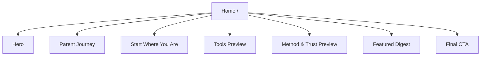

# Site Map

## IA Principle

The site should not be organized around internal categories such as "products," "resources," and "community" as equal buckets. That creates a flat site map and makes the parent do the work of figuring out what matters.

The site should be organized around the parent's intent:

1. I need to understand what this is.
2. I need to know where to begin.
3. I need to learn the method.
4. I need tools for my family.
5. I need reminders/resources to stay consistent.
6. I need trust before I commit.

This makes `Start Here` the primary routing page, `Pathways` the signature guided structure, `Tools` the product ecosystem, and `Library` the ongoing practice layer.

## Recommended Top-Level Navigation

Primary:

- Start Here
- Pathways
- Tools
- Library
- About

Utility:

- Community
- Login
- Cart

Why this is stronger:

- `Start Here` handles uncertain visitors.
- `Pathways` expresses intentionality, sequence, and guided tarbiyah.
- `Tools` keeps products in service of an intention.
- `Library` is clearer than "Resources" and can contain digest, guides, routines, and downloads.
- `About` absorbs trust, mission, sourcing, and contact.
- `Community` can be a strong CTA without crowding the main IA.

## Current Site

## Proposed Site Architecture

```mermaid
flowchart TD
  Home["/ Home"]

  Home --> StartHere["/start-here Start Here"]
  Home --> Pathways["/pathways Pathways"]
  Home --> Tools["/tools Tools"]
  Home --> Library["/library Library"]
  Home --> About["/about About"]

  StartHere --> FoundationsPath["/start-here/foundations I Need Foundations"]
  StartHere --> RhythmPath["/start-here/family-rhythm I Need Family Rhythm"]
  StartHere --> ChildToolsPath["/start-here/child-ready-tools I Need Child-Ready Tools"]
  StartHere --> ScreenPath["/start-here/screens-and-devices I Need Screen/Device Guidance"]

  Pathways --> FoundationsPathway["/pathways/foundations Foundations Pathway"]
  Pathways --> RhythmPathway["/pathways/family-rhythm Family Rhythm Pathway"]
  Pathways --> NamesPathway["/pathways/names-and-identity Names & Identity Pathway"]
  Pathways --> QuranPathway["/pathways/quran-companion Qur'an Companion Pathway"]
  Pathways --> AdabPathway["/pathways/adab-and-character Adab & Character Pathway"]
  Pathways --> ScreensPathway["/pathways/screen-free-learning Screen-Free Learning Pathway"]

  Tools --> ToolIndex["/tools Tool Finder"]
  Tools --> BaytulAsmaa["/tools/baytul-asmaa Baytul Asmaa"]
  Tools --> QuranDevice["/tools/quran-companion-device Qur'an Companion Device"]
  Tools --> TarbiyahCorner["/tools/tarbiyah-corner-library Tarbiyah Corner Library"]
  Tools --> FutureSystems["/tools/systems Future Systems"]

  Library --> Digest["/library/jumuah-digest Jumu'ah Digest"]
  Library --> Guides["/library/guides Parent Guides"]
  Library --> Routines["/library/routines Family Routines"]
  Library --> Downloads["/library/downloads Downloads"]
  Library --> Method["/library/method The brilliantroots Method"]

  About --> Mission["/about/mission Mission"]
  About --> Trust["/about/trust Trust & Review"]
  About --> Contact["/contact Contact"]

  Home --> Community["/community Community"]
  Tools --> Cart["/cart Cart"]
  Home --> Login["/login Login"]
```

## Navigation Behavior

### Desktop

Main nav:

- Start Here
- Pathways
- Tools
- Library
- About

Right side:

- Community
- Login

Future commerce state:

- Cart icon appears only once commerce is active.

### Mobile

Mobile nav should group links by task:

- Begin
  - Start Here
  - Take the guided path
- Pathways
  - Foundations
  - Family Rhythm
  - Names & Identity
  - Qur'an Companion
  - Adab & Character
  - Screen-Free Learning
- Tools
  - Tool Finder
  - Baytul Asmaa
  - Qur'an Companion Device
  - Tarbiyah Corner Library
- Keep Going
  - Jumu'ah Digest
  - Guides
  - Community
- Trust
  - About
  - Trust & Review
  - Contact

## Page Roles

### `/` Home

Role: Orientation and routing.

The home page should not attempt to contain the whole site. It should explain the promise, name the parent problem, preview the journey, and route users to the right hub.

Primary routes from Home:

- Unsure parent -> `/start-here`
- Method/trust seeker -> `/library/method`
- Product-ready parent -> `/tools`
- Low-commitment visitor -> `/library/jumuah-digest`

### `/start-here`

Role: Guided routing hub.

This is the most important IA page after Home. It should help parents self-identify their need without making them read the whole site.

Recommended paths:

- I need foundations.
- I need a family rhythm.
- I need child-ready tools.
- I need screen/device guidance.

Each path should include:

- The parent problem.
- What to do first.
- Recommended resource.
- Recommended tool if relevant.
- One small weekly action.

### `/pathways`

Role: Guided intention hub.

This section is the main differentiator. A pathway converts a parent intention into a sequence: clarify, understand, practice, equip, continue.

Subpages:

- `/pathways/foundations`
- `/pathways/family-rhythm`
- `/pathways/names-and-identity`
- `/pathways/quran-companion`
- `/pathways/adab-and-character`
- `/pathways/screen-free-learning`

Why `Pathways` is better than top-level `Learn`:

- It is more distinctive.
- It expresses intentionality and sequence.
- It makes the site feel guided, not encyclopedic.
- It lets tools and resources appear in context.

### `/tools`

Role: Product ecosystem and tool finder.

This should feel like "choose the right support for your family," not "browse our shop."

Subpages:

- `/tools/baytul-asmaa`
- `/tools/quran-companion-device`
- `/tools/tarbiyah-corner-library`
- `/tools/systems`

Filtering logic:

- By need: names, Qur'an, parent formation, routines, adab, screens.
- By format: digital platform, device, book, printable, guide.
- By stage: expecting parents, early years, young children, older children, parent-only.

### `/library`

Role: Ongoing free/low-friction support.

The library should help parents keep practicing even before they buy anything. It should be organized by intention, not by publish date alone.

Subpages:

- `/library/jumuah-digest`
- `/library/guides`
- `/library/routines`
- `/library/downloads`
- `/library/method`

Content should be tagged by job:

- Learn foundations.
- Practice this week.
- Teach a child.
- Build routine.
- Choose a tool.

### `/about`

Role: Trust, mission, and legitimacy.

This page should answer:

- Who is behind brilliantroots?
- What is the mission?
- What methodology guides the work?
- How are resources reviewed?
- What does brilliantroots avoid?

Subpages can come later:

- `/about/mission`
- `/about/trust`

### `/community`

Role: Belonging and continuity.

This should not be a vague social link page. It should explain:

- What members receive.
- Channel etiquette.
- Frequency.
- Who it is for.
- How to join.

Community can also be a CTA across the site instead of a main nav item in early versions.

### `/contact`

Role: Support and questions.

This page should route:

- Product questions.
- Wholesale/publishing inquiries.
- Community questions.
- General contact.

## Phase Plan

### Phase 1: Logical MVP

Build only what is needed to make the ecosystem understandable.

- `/`
- `/start-here`
- `/pathways`
- `/pathways/foundations`
- `/pathways/family-rhythm`
- `/tools`
- `/tools/baytul-asmaa`
- `/tools/quran-companion-device`
- `/tools/tarbiyah-corner-library`
- `/library/jumuah-digest`
- `/library/method`
- `/about`
- `/contact`

Do not build separate pages for every future system yet. Mention them as "coming later" inside Tools or Learn.

### Phase 2: Practice Layer

Add content that supports consistency.

- `/pathways/names-and-identity`
- `/pathways/quran-companion`
- `/pathways/adab-and-character`
- `/pathways/screen-free-learning`
- `/library/guides`
- `/library/routines`
- `/library/downloads`
- `/community`

### Phase 3: Commerce and Account Layer

Add only once there is enough product/checkout logic.

- `/cart`
- `/checkout`
- `/account`
- `/orders`
- `/tools/systems`

### Phase 4: Publishing / Broader Ecosystem

Add if brilliantroots expands beyond family tools into publishing and author support.

- `/publishing`
- `/authors`
- `/library`

## Recommended Footer Architecture

Start:

- Start Here
- Pathways
- Tool Finder
- Jumu'ah Digest

Pathways:

- Foundations
- Family Rhythm
- Names & Identity
- Qur'an Companion
- Adab & Character

Tools:

- Baytul Asmaa
- Qur'an Companion Device
- Tarbiyah Corner Library
- Coming Soon

Trust:

- About
- Trust & Review
- Contact
- Privacy
- Terms

## What Not To Do

- Do not put `Community`, `About`, `Contact`, and `Login` at the same IA level as the main parent journey.
- Do not make every product category a top-level nav item.
- Do not create a large content library before the brand has clear cornerstone pathways.
- Do not call the main product area "Shop" too early if the brand promise is guidance.
- Do not make the homepage responsible for explaining every page.

## Decision Rule

If a page does not help the parent do one of these, it should not exist yet:

1. Understand brilliantroots.
2. Choose a starting point.
3. Trust the method.
4. Find the right tool.
5. Practice this week.
6. Ask for help or join continuity.
