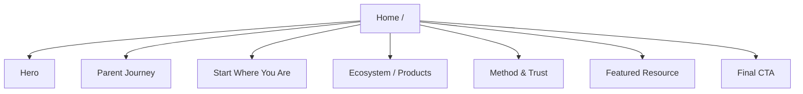

# Site Map

## Current Site

## Recommended Public Site

```mermaid
flowchart TD
  Home["Home"]

  Home --> StartHere["Start Here"]
  Home --> Methodology["Methodology"]
  Home --> Products["Products"]
  Home --> Resources["Resources"]
  Home --> Community["Community"]
  Home --> About["About / Trust"]
  Home --> Contact["Contact"]

  StartHere --> Foundations["I Need Foundations"]
  StartHere --> Rhythm["I Need Family Rhythm"]
  StartHere --> Tools["I Need Child-Ready Tools"]
  StartHere --> Digital["I Need Screen / Device Guidance"]
  StartHere --> Join["I Want Community"]

  Methodology --> Tarbiyah["What Is Tarbiyah?"]
  Methodology --> ParentFirst["Parent First"]
  Methodology --> HouseholdRhythm["Household Rhythm"]
  Methodology --> ReviewProcess["Review / Advisory Process"]

  Products --> BaytulAsmaa["Baytul Asmaa"]
  Products --> MQCD["My Qur'an Companion Device"]
  Products --> TarbiyahCorner["Tarbiyah Corner Library"]
  Products --> Systems["Tarbiyah Systems"]

  Resources --> Digest["Jumu'ah Digest"]
  Resources --> Guides["Parent Guides"]
  Resources --> Routines["Family Routines"]
  Resources --> Downloads["Free Downloads"]
  Resources --> Articles["Articles"]

  Community --> WhatsApp["WhatsApp"]
  Community --> Telegram["Telegram"]
  Community --> Newsletter["Email Newsletter"]

  Products --> Cart["Cart / Checkout"]
  Home --> Login["Login / Account"]
```

## Navigation Labels

Primary nav:

- Start Here
- Method
- Products
- Resources
- Community

Secondary/footer:

- About
- Contact
- Login
- Privacy
- Terms

## Page Inventory

### Phase 1

- `/` Home
- `/start-here`
- `/method`
- `/products`
- `/products/baytul-asmaa`
- `/products/quran-companion-device`
- `/products/tarbiyah-corner-library`
- `/resources`
- `/resources/jumuah-digest`
- `/about`
- `/contact`

### Phase 2

- `/resources/guides`
- `/resources/routines`
- `/resources/downloads`
- `/community`
- `/systems`
- `/systems/adhkar`
- `/systems/salah`
- `/systems/adab`
- `/systems/aqidah`
- `/account`
- `/cart`
- `/checkout`

### Phase 3

- `/learn`
- `/learn/foundations`
- `/learn/parent-formation`
- `/learn/child-conversations`
- `/library`
- `/authors`
- `/publishing`
- `/support`

## URL Principles

- Use short, plain labels.
- Avoid internal brand jargon in URLs.
- Product URLs should be descriptive and stable.
- Resource URLs should support SEO and sharing.
- Keep `Start Here` as a top-level route because it is the main guided entry.

