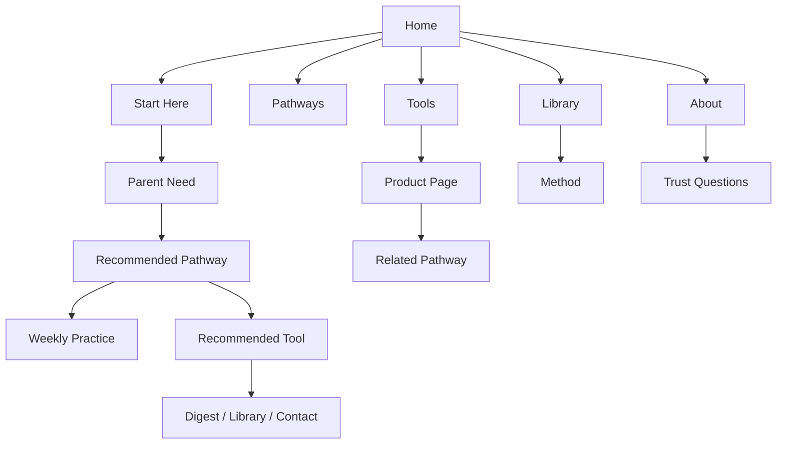

# brilliantroots System Design

## System Intent

The website is now a routed tarbiyah ecosystem rather than a single-page landing experience.

The system should answer this parent question at every level:

```text
What is the most intentional next step for this family right now?
```

## Route Model

```text
/                         Home: orientation and routing
/start-here               Guided parent decision page
/pathways                 Pathway index
/pathways/[slug]          Pathway detail pages
/tools                    Tool finder and product ecosystem
/tools/[slug]             Product education pages
/library                  Practice and continuity hub
/library/jumuah-digest    Weekly continuity page
/library/method           Method and trust framework
/about                    Mission and trust
/contact                  Support routing
```

## Content Model

Shared IA data lives in `src/lib/site-content.ts`.

It defines:

- top-level navigation
- intentionality steps
- Start Here decision routes
- pathway slugs and detail content
- tool slugs and product education content

This keeps the system coherent: navigation, page indexes, and detail pages can grow from one source of truth instead of repeating separate copy blocks.

## Page Components

Shared route UI lives in `src/components/page/`.

- `PageHero` standardizes page introductions.
- `IntentionalityStrip` repeats the five-step operating system.
- `RouteCard`, `DetailPanel`, `CheckList`, and `CTASection` provide consistent page sections.

The goal is not to make every page identical. The goal is to keep the parent journey legible while leaving room for richer page-specific sections later.

## Flow Logic



## Design Rule

The site should not force every visitor to buy, subscribe, or read everything.

Each page should route to one of five actions:

1. Clarify intention.
2. Understand the principle.
3. Practice this week.
4. Choose a fitting tool.
5. Continue with support.

## Phase One Status

Implemented:

- real top-level routes
- dynamic pathway detail pages
- dynamic tool detail pages
- routed navigation and footer
- homepage CTAs to real pages
- library method and digest pages
- about and contact routing pages

Still future:

- richer product media and commerce
- library guide/routine subpages
- community page
- account/cart/checkout layer
- deeper trust/review process content
